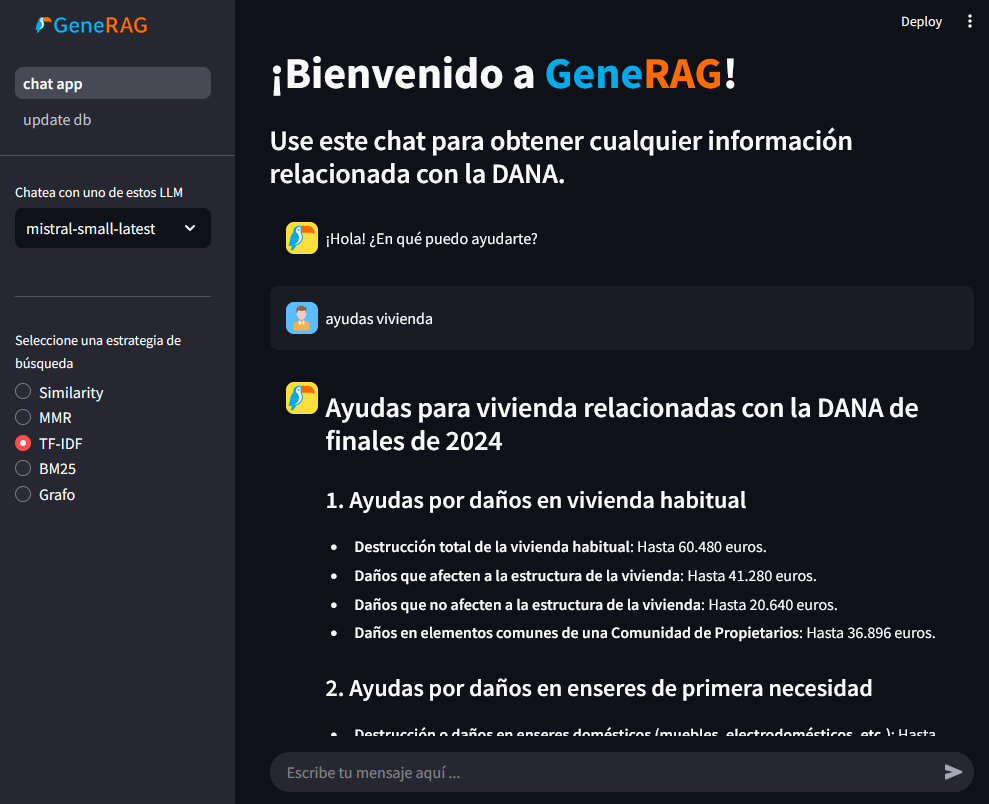
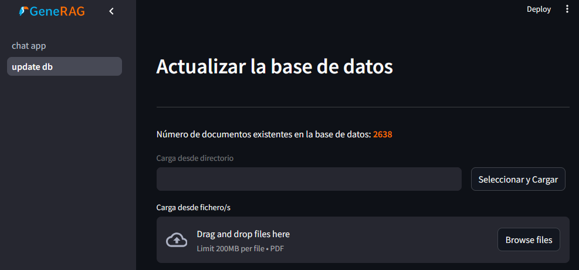

# 

   

**👨‍💻 Autor:** Pablo Valenzuela Álvarez  
**📚 Directores:** David Griol Barres y Zoraida Callejas Carrión  

##  Resumen (en proceso)

Este es el repositorio de mi TFM, cuyo tema es la creación de un sistema RAG.

Como corpus se han utilizado documentos del BOE relacionados con la DANA. El objetivo es asistir en la respuesta facilitando cualquier información contenida en los documentos.

Se han utilizado técnicas de integración continua (CI/CD) para la obtención de documentos, y de testeo sobre la calidad de respuesta del RAG.

( ... )

## 🖼️ Capturas

<figure>
  
  <figcaption>Figura 1: Página principal de la aplicación</figcaption>
</figure>

<figure>
  
  <figcaption>Figura 2: Página de actualización de la base de datos</figcaption>
</figure>

## ⚙️ Tecnologías usadas  

